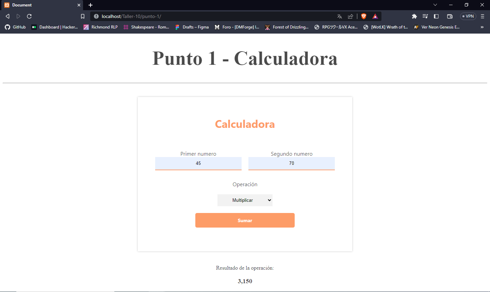
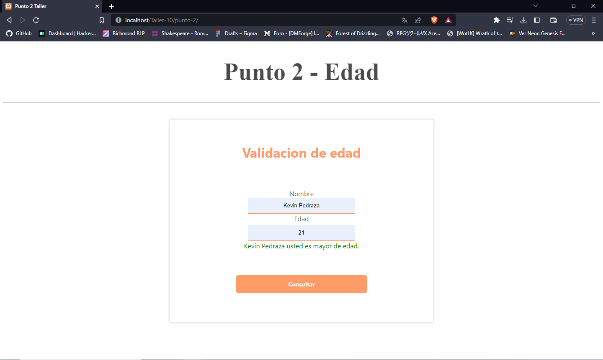
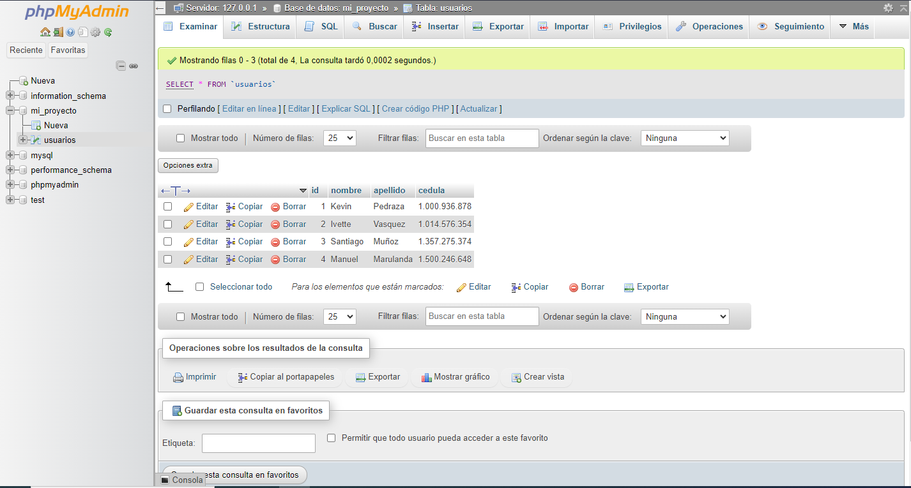
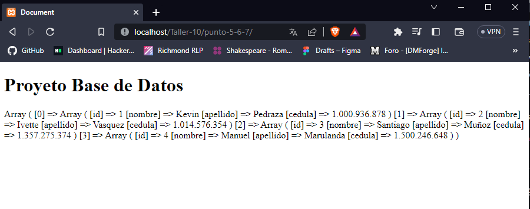

<h1>Taller 9: Kevin Alejandro Pedraza Diaz</h1>

<h2>Información</h2>

Curso: Full Stack Basico - Grupo 1

Profesor Cristian Patiño

<h2>Punto 1:</h2>
<h3>Calculadora</h3>

<h2>Punto 2:</h2>
<h3>Edad</h3>

<h2>Punto 3:</h2>

<h2>Punto 4:</h2>

<h2>Punto 5-6-7:</h2>
<h3>5 - Base de datos</h3>

<h3>6 - Conexión</h3>
